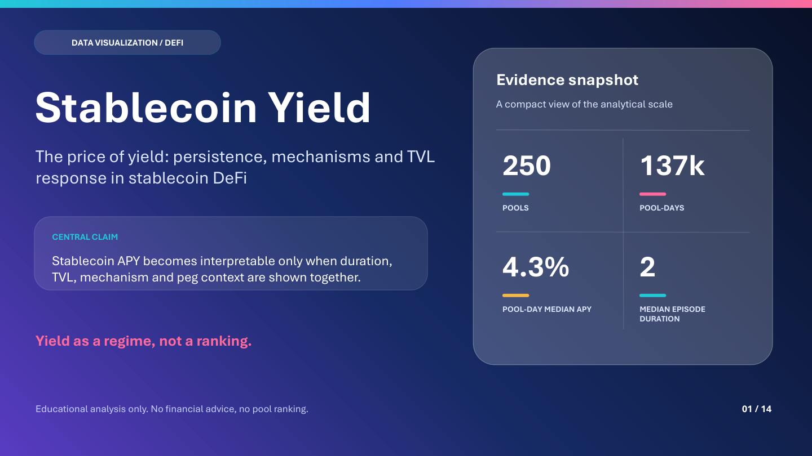

# The Price of Yield

[](https://github.com/Laimon99/stablecoin-yield-visualization/actions/workflows/ci.yml)


**A visual case study of persistence, mechanisms and observed TVL response in stablecoin DeFi.**

**Simone Ragusini** · Master's-level Data Visualization project · End-to-end analysis,
visual storytelling and reproducible research pipeline

**Student ID:** 945119 · **Email:** s.ragusini@campus.unimib.it

## File to submit

Submit **only [Simone_Ragusini_945119.pdf](outputs/submission/refined/Simone_Ragusini_945119.pdf)**.
This self-contained 17-page PDF includes the results, actual Matplotlib and
Plotly figures, methods, limitations, author details, repository link and licences.
The editable deck, HTML, extended report and ZIP below are supporting materials,
not additional exam uploads. The evaluation is asynchronous.

## Final refinement, September 2026

The latest submission corrects the APY-jump trigger to require consecutive calendar
observations: 450 events, median APY 18.09% at day 0 and 8.24% at day 30.
A paired check on the same 439 events supports the direction of the result.
The PDF now states every screening threshold, shows an accurate bubble-size key,
distinguishes zero reward medians from missing data, embeds clickable links and
reports a whole-pool bootstrap sensitivity interval for day-30 survival.

- [Final editable deck](outputs/refinement/Simone_Ragusini_945119_Stablecoin_Yield_refined.pptx)
- [Refinement methods and reproduction](docs/refinement.md)
- [Corrected event aggregates](outputs/refinement/apy_tvl_event_response.csv)

`uv run python scripts/refine_submission.py` reconstructs static charts from the
new published aggregates. Recomputing the pool bootstrap and paired sensitivity
requires the author's private historical panel and `--refresh-local`.
The earlier PDFs and analytical reports below remain historical comparison
artifacts: their 453-event result predates the calendar-day correction.

## Revised submission, September 2026

The revision responds to the instructor's feedback with explicit authorship,
two demonstrated visualization tools, a linked repository, reproducible aggregate
evidence, licences and more precise statistical interpretation.

- [Revised presentation PDF (17 slides)](outputs/revision/Simone_Ragusini_945119_Stablecoin_Yield.pdf)
- [Revised editable PowerPoint](outputs/revision/Simone_Ragusini_945119_Stablecoin_Yield.pptx)
- [Revised analytical report (20 pages)](outputs/revision/Simone_Ragusini_945119_Report.pdf)
- [Offline interactive Plotly companion](outputs/revision/stablecoin_yield_interactive.html) (download and open in a browser)
- [Response to every feedback point](docs/feedback_response.md)
- [Reproduction guide](docs/reproduction.md) and [oral-defense guide](docs/oral_defense_revision.md)

**Two visualization tools:** Matplotlib for the static analytical figures and
Plotly for interactive survival, churn and sensitivity charts. Seaborn supports
Matplotlib; Artifact Tool assembles the PowerPoint.

Reproduce the published aggregate evidence without provider API access:

```sh
uv sync --frozen --extra dev
uv run python scripts/reproduce_published.py
```

This checks headline consistency and creates the self-contained HTML companion
and a JSON audit with source hashes and actual library versions. It does not
claim reconstruction of the undistributed historical raw data. For the full
method against live APIs, see the separate instructions below.

The links below retain the original July analytical deliverables for comparison.

[**View the visual case study (PDF)**](outputs/presentation/stablecoin_yield_presentation.pdf)
· [Read the full report](outputs/report/stablecoin_yield_report.pdf)

[](outputs/presentation/stablecoin_yield_presentation.pdf)

## The project in 30 seconds

DeFi interfaces often reduce yield to one annualized percentage. I analyzed **250 stablecoin
pools and 137,095 daily observations** to test whether high quoted yields persist, what produces
them and how they relate to deposited capital and stablecoin stress.

> **Headline finding:** high yield is common in snapshots, but persistent high yield with
> capacity and interpretable context is much rarer.

The project turns that question into a reproducible visual analysis rather than a pool ranking
or investment recommendation.

### Plain-English glossary

- **APY:** the annualized yield quoted by a protocol, not necessarily the return an investor realizes.
- **TVL:** the value deposited in a protocol, used here as a capacity and activity proxy.
- **Pool-day:** one liquidity or lending pool observed on one calendar day.

## Key findings

- The median contiguous episode above 10% quoted APY lasts **2 days**.
- Ranking churn rises from **13.5% after 1 day** to **33.3% after 30 days**.
- Only **38 of 250 pools (15.2%)** clear the sample medians for APY, persistence and TVL
  simultaneously.
- APY and TVL move on different clocks; the event study is descriptive and does not identify
  wallet-level capital flows.
- Reward composition, pool type and peg context materially change how a quoted APY should be
  interpreted.

These results are sample-specific and non-causal. The project makes its assumptions and
limitations explicit rather than presenting a hidden safety score.


## What this portfolio project demonstrates

- **Data engineering:** API ingestion, checksummed raw envelopes, canonical schemas and entity
  resolution.
- **Statistical analysis:** episode survival, ranking churn, event studies, clustering and
  robustness checks.
- **Data visualization:** ten publication-ready figures, a 14-slide narrative deck and a
  16-page analytical report.
- **Research communication:** plain-language findings, documented limitations and a clear
  separation between descriptive evidence and financial advice.
- **Software quality:** configuration-driven Python package, locked dependencies, automated
  tests and GitHub Actions CI.

## Portfolio deliverables

1. [Visual case study — presentation PDF](outputs/presentation/stablecoin_yield_presentation.pdf)
2. [Editable exam presentation — PowerPoint](outputs/presentation/stablecoin_yield_presentation.pptx)
3. [Presentation overview](outputs/presentation/stablecoin_yield_presentation_powerpoint_contact_sheet.png)
4. [Full analytical report](outputs/report/stablecoin_yield_report.pdf)
5. [Oral-defense notes](docs/oral_defense.md)
6. [Data-quality report](outputs/quality/data_quality_report.md)
7. [Figure registry](outputs/figures/figure_registry.csv)

The original 14-slide exam presentation is retained as a historical version. Its integrity record is documented in
[docs/exam_presentation_integrity.md](docs/exam_presentation_integrity.md).

## How the analysis works

```text
Official APIs
    -> checksummed request envelopes
    -> canonical pool and pool-day tables
    -> quality gates and entity resolution
    -> episode, churn, event and robustness analyses
    -> figures, report and presentation
```

The pipeline keeps ingestion, transformation, analysis, visualization and reporting separate.
High-yield episodes are contiguous runs above a declared threshold with explicit rules for
missing observations and right-censoring.

## Repository layout

```text
config/        Source, metric and visualization configuration
docs/          Methodology, source register, decisions, QA and defense notes
outputs/       Curated aggregate tables, figures, report and exam presentation
scripts/       Reproducible command-line pipeline stages
src/           Installable Python package
tests/         Unit, contract, integration and regression tests
```

Raw API responses and row-level processed datasets are deliberately not distributed. A local
run creates them under `data/`, which is ignored by Git. See [NOTICE.md](NOTICE.md) and the
[source registry](docs/source_registry.md) for attribution and the public-data boundary.

## Reproduce locally

Requirements: Python 3.11+ and [uv](https://docs.astral.sh/uv/).

```bash
uv sync --frozen --extra dev
uv run ruff check src scripts tests
uv run pytest
```

Run a smaller live-data pipeline:

```bash
uv run python scripts/reproduce_all.py --mode sample
```

Run the full 250-pool pipeline:

```bash
uv run python scripts/reproduce_all.py --mode full
```

Both commands access third-party APIs under the operator's acceptance of their current terms
and rate limits. Results can change as source data are revised. An optional CoinGecko key can
be supplied through `COINGECKO_API_KEY`; it is sent as a request header and is never written to
raw request metadata.

The PowerPoint builder depends on Codex's `@oai/artifact-tool` runtime and is excluded from the
portable default pipeline. Where that runtime is available, use:

```bash
uv run python scripts/reproduce_all.py --mode full --with-presentation
```

The committed exam deck remains available even when the optional builder is unavailable.

## Reproducibility boundary

The committed report and presentation preserve the audited analysis through 8 July 2026. A
fresh run reproduces the method against data available at execution time; byte-for-byte
reconstruction of the private historical source snapshot is not promised by the public
repository.

## Responsible interpretation

APY is a quoted annualized value, not realized return. TVL change is an observed balance proxy,
not direct net capital flow. The project does not fully measure smart-contract, counterparty,
bridge, oracle, liquidity, legal or investor-specific risk. No output identifies a "best" pool.

## About

- **Author:** [Simone Ragusini](https://github.com/Laimon99)
- **Context:** Master's-level academic project for a Data Visualization course
- **Role:** Research framing, data pipeline, statistical analysis, visualization, reporting and QA
- **Core stack:** Python, pandas, NumPy, Matplotlib, Seaborn, scikit-learn, lifelines, DuckDB,
  Plotly, ReportLab, PowerPoint, Pytest, Ruff and GitHub Actions

## Attribution and rights

The analysis uses official DeFiLlama and CoinGecko APIs. Provider attribution and current terms
are recorded in [NOTICE.md](NOTICE.md). Original code uses the MIT License; original
presentation, report, documentation and authored visual expression use CC BY 4.0.
See [LICENSE](LICENSE) for scope. No third-party data rights are granted.
