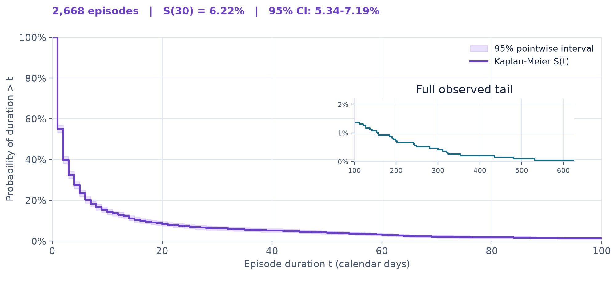

# Stablecoin Yield

A visual study of how long high stablecoin yields last, what produces them, and how deposited capital changes around yield spikes in decentralized finance.

**[View the final presentation (PDF)](outputs/submission/refined/Simone_Ragusini_945119.pdf)** · [Read the methodology](docs/refinement.md)



**The median observed episode at or above 10% annualized yield lasts two days.** Duration, yield mechanism and pool capacity give a quoted rate the context it needs.

## The project in 30 seconds

- **Question:** Does a high quoted yield persist, and what context is lost in a single percentage?
- **Evidence:** 250 stablecoin pools and 137,095 pool-days, from 11 February 2022 to 8 July 2026.
- **Output:** A 17-page visual case study, supporting aggregate evidence and a reproducible Python pipeline.
- **Purpose:** Explain yield trade-offs and uncertainty without turning descriptive results into investment recommendations.

**APY** is a quoted annualized yield, not necessarily a realized return. **TVL** is the USD value deposited in a pool. A **pool-day** is one pool observed on one calendar day.

## What this project demonstrates

- **Statistical reasoning:** episode survival, ranking churn, event studies and sensitivity checks with explicit denominators and limitations.
- **Visual communication:** a narrative presentation using actual Matplotlib and Plotly figures, supported by an interactive companion.
- **Reproducible engineering:** API ingestion, checksummed source records, locked dependencies, automated checks and documented public-data boundaries.
- **Research communication:** traceable findings, a source registry and a clear distinction between observed associations and causal claims.

## Key findings

| Lens | Sample result | Interpretation |
| --- | --- | --- |
| Yield distribution | Median APY **4.29%**, mean **8.03%** | A single average masks a skewed distribution. |
| Persistence | Median episode **2 days**; estimated survival beyond day 30 **6.22%** | Most observed high-yield episodes are short. |
| Ranking churn | **13.5%** after one day, **33.3%** after 30 days | A snapshot ranking becomes less stable over time. |
| Yield spikes | Across **450 events**, median APY moves from **18.09%** at day 0 to **8.24%** at day 30 | The event profile is descriptive; the observed cohort varies by day. |
| Joint screen | **38/250 pools (15.2%)** meet the sample-median APY, persistence and TVL thresholds together | Yield, duration and capacity need to be considered jointly. |

The paired endpoint check retains the same 439 events and supports the direction of the APY result. The presentation and [methodology](docs/refinement.md) report the sample sizes, inclusive screening thresholds and observation rules.

## Verification and limitations

The analysis uses DeFiLlama and CoinGecko data in a selected, unbalanced panel. Results describe this sample and observation window.

- **Uncertainty:** day-30 survival has an original 95% pointwise interval of 5.34%-7.19%; a whole-pool bootstrap gives 4.76%-7.86%. Neither corrects selection bias or observation boundaries.
- **Interpretation:** quoted APY is not realized return; TVL changes are not direct wallet-level net flows. Event profiles do not establish causality.
- **Risk coverage:** the project does not fully estimate smart-contract, counterparty, bridge, oracle or liquidity risk.
- **Reproduction:** public aggregates reconstruct the published static evidence. Recomputing the historical panel, paired diagnostics and bootstrap requires the author's undistributed historical data.

Inspect the [refinement audit](outputs/refinement/refinement_audit.json), [data-quality report](outputs/quality/data_quality_report.md) and [source registry](docs/source_registry.md).

[](https://github.com/Laimon99/stablecoin-yield-visualization/actions/workflows/ci.yml)

CI checks linting and automated tests; it does not certify the economic interpretation of the results.

## How it works

Official APIs feed checksummed request records, canonical pool and pool-day tables, quality checks, statistical analyses and finally figures and documents. Ingestion, analysis and presentation are separate stages.

**Core stack:** Python, pandas, NumPy, lifelines, scikit-learn and DuckDB for analysis; Matplotlib, Seaborn and Plotly for visualization; ReportLab and an optional Artifact Tool builder for documents; Pytest, Ruff and GitHub Actions for checks.

## Reproduce the published evidence

Requirements: Python 3.11+ and [uv](https://docs.astral.sh/uv/).

```sh
git clone https://github.com/Laimon99/stablecoin-yield-visualization.git
cd stablecoin-yield-visualization
uv sync --frozen --extra dev
uv run python scripts/refine_submission.py
```

The final command checks event headlines against the published table and rebuilds static charts without API calls. Add `--output-dir PATH` to write the graphics elsewhere. See the [reproduction details](docs/refinement.md#public-aggregate-reconstruction).

<details>
<summary>Quality checks, live data and environment notes</summary>

```sh
uv run ruff check src scripts tests
uv run pytest
```

To run the full method against live APIs, use a separate checkout:

```sh
uv run python scripts/reproduce_all.py --mode full
```

This writes new outputs and results can change with provider data. Provider terms and rate limits apply; see [NOTICE.md](NOTICE.md). Raw and row-level datasets stay under the ignored `data/` directory. An optional CoinGecko key uses the `COINGECKO_API_KEY` environment variable.

On Windows with Python 3.11 and accented checkout paths, use `$env:PYTHONPATH = (Resolve-Path src).Path` if editable imports fail.

The optional PowerPoint builder requires Codex's Artifact Tool runtime. See [presentation rebuilding](docs/refinement.md#presentation-rebuilding); the committed deck remains available without that runtime.

</details>

## Supporting material

| Artifact | Purpose |
| --- | --- |
| [Editable final PowerPoint](outputs/refinement/Simone_Ragusini_945119_Stablecoin_Yield_refined.pptx) | Source deck for the final 17-page presentation |
| [Interactive Plotly companion](outputs/revision/stablecoin_yield_interactive.html) | Survival, churn and threshold sensitivity; download and open locally |
| [Corrected event aggregates](outputs/refinement/apy_tvl_event_response.csv) | Daily APY and TVL event profiles |
| [Mechanism coverage](outputs/refinement/mechanism_coverage.csv) | Available observations for yield components |

## Exam snapshot and version history

The [exam-2026-09-23 release](https://github.com/Laimon99/stablecoin-yield-visualization/releases/tag/exam-2026-09-23) records the final exam PDF and its source commit. Later portfolio updates remain separate from that snapshot. See [artifact identity and checksums](docs/exam_submission.md).

<details>
<summary>Earlier presentations and reports</summary>

These are historical comparison artifacts. Their 453-event analysis predates the consecutive-calendar-day correction to 450 events; use the final presentation for current findings.

- [First revised presentation, 17 pages](outputs/revision/Simone_Ragusini_945119_Stablecoin_Yield.pdf)
- [Revised analytical report, 20 pages](outputs/revision/Simone_Ragusini_945119_Report.pdf)
- [Original presentation, 14 pages](outputs/presentation/stablecoin_yield_presentation.pdf)
- [Original analytical report, 16 pages](outputs/report/stablecoin_yield_report.pdf)
- [Response to instructor feedback](docs/feedback_response.md)
- [Original presentation integrity record](docs/exam_presentation_integrity.md)

</details>

## Author, status and rights

**[Simone Ragusini](https://github.com/Laimon99)** · Student ID 945119 · s.ragusini@campus.unimib.it

Master's-level Data Visualization project covering research framing, data engineering, statistical analysis, visualization and reporting. An educational portfolio project, not an investment advisory service.

Original code is MIT-licensed; original presentation, report, documentation and authored visual expression use CC BY 4.0. Third-party data retain their own terms. See [LICENSE](LICENSE) and [NOTICE.md](NOTICE.md).
