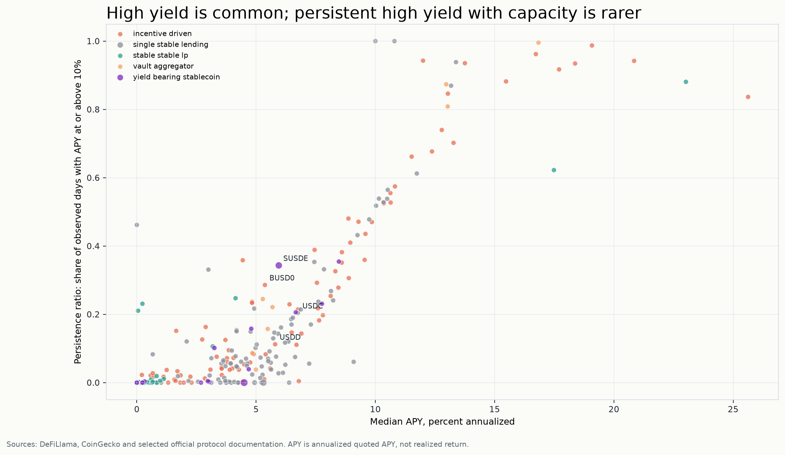

# The Price of Yield

[](https://github.com/Laimon99/data_viz/actions/workflows/ci.yml)


**Persistence, mechanisms and observed TVL response in stablecoin DeFi.**

DeFi interfaces reduce yield to one annualized percentage. This project tests why that
number is not enough: high APY can be short-lived, incentive-dependent, capacity-constrained
or observed during stablecoin stress. The result is a reproducible visual analysis, not a
pool ranking or an investment recommendation.



## What the analysis found

The frozen study covers **250 pools and 137,095 pool-days** through 8 July 2026.

- The median contiguous episode above 10% quoted APY lasts **2 days**.
- Ranking churn rises from **13.5% after 1 day** to **33.3% after 30 days**.
- Only **38 of 250 pools (15.2%)** clear the sample medians for APY, persistence and TVL
  simultaneously.
- APY and TVL move on different clocks; the event study is descriptive and does not identify
  wallet-level capital flows.
- Reward composition, pool type and peg context materially change how a quoted APY should be
  interpreted.

These are sample-specific, non-causal results. See [methodology](docs/methodology.md) and
[limitations](docs/limitations_ethics.md) before interpreting them.

## Portfolio artifacts

- [Final analytical report (PDF)](outputs/report/stablecoin_yield_report.pdf)
- [Exam presentation (PowerPoint)](outputs/presentation/stablecoin_yield_presentation.pptx)
- [Presentation PDF](outputs/presentation/stablecoin_yield_presentation.pdf)
- [PowerPoint-rendered presentation overview](outputs/presentation/stablecoin_yield_presentation_powerpoint_contact_sheet.png)
- [Oral-defense notes](docs/oral_defense.md)
- [Figure registry](outputs/figures/figure_registry.csv)
- [Data-quality report](outputs/quality/data_quality_report.md)

The exam presentation is intentionally frozen. Its integrity record is documented in
[docs/exam_presentation_integrity.md](docs/exam_presentation_integrity.md).

## Analytical workflow

```text
Official APIs
    -> checksummed request envelopes
    -> canonical pool and pool-day tables
    -> quality gates and entity resolution
    -> episode, churn, event and robustness analyses
    -> figures, report and presentation
```

The pipeline is configuration-driven and keeps ingestion, transformation, analysis,
visualization and reporting separate. The main analytical grain is one pool-day. High-yield
episodes are contiguous runs above a declared threshold with explicit gap and censoring rules.

## Repository layout

```text
config/        Source, metric and visualization configuration
docs/          Methodology, source register, decisions, QA and defense notes
outputs/       Curated aggregate tables, figures, report and exam presentation
scripts/       Reproducible command-line pipeline stages
src/           Installable Python package
tests/         Unit, contract, integration and regression tests
```

Raw API responses and row-level processed datasets are deliberately not distributed. Current
provider terms restrict republication or redistribution. A local run creates them under
`data/`, which is ignored by Git. See [NOTICE.md](NOTICE.md) and the
[source registry](docs/source_registry.md).

## Run locally

Requirements: Python 3.11+ and [uv](https://docs.astral.sh/uv/).

```bash
uv sync --extra dev
uv run ruff check src scripts tests
uv run pytest
```

Run a smaller live-data pipeline:

```bash
uv run python scripts/reproduce_all.py --mode sample
```

Run the full 250-pool pipeline:

```bash
uv run python scripts/reproduce_all.py --mode full
```

Both commands access third-party APIs under the operator's own acceptance of their current
terms and rate limits. Results can change as source data are revised. An optional CoinGecko key
can be supplied through `COINGECKO_API_KEY`; it is sent as a request header and is never written
to raw request metadata.

The PowerPoint builder depends on Codex's `@oai/artifact-tool` runtime and is therefore excluded
from the portable default pipeline. Where that runtime is available, use:

```bash
uv run python scripts/reproduce_all.py --mode full --with-presentation
```

The committed exam deck remains available even when the optional builder is unavailable.

## Reproducibility boundary

The code and aggregate evidence are public-ready; the original provider payloads remain local.
Consequently:

- the committed report and presentation preserve the audited 8 July 2026 analysis;
- a fresh run reproduces the method against data available at execution time;
- exact byte-for-byte reconstruction of the historical raw snapshot requires the private local
  archive and is not promised by the public repository.

## Responsible interpretation

APY is a quoted annualized value, not realized return. TVL change is an observed balance proxy,
not direct net capital flow. The project does not fully measure smart-contract, counterparty,
bridge, oracle, liquidity, legal or investor-specific risk. No output identifies a "best" pool.

## Attribution and rights

The analysis uses official DeFiLlama and CoinGecko APIs. Provider attribution and current terms
are recorded in [NOTICE.md](NOTICE.md). Original project code and authored materials are reserved
under [LICENSE](LICENSE); no third-party data rights are granted by this repository.
